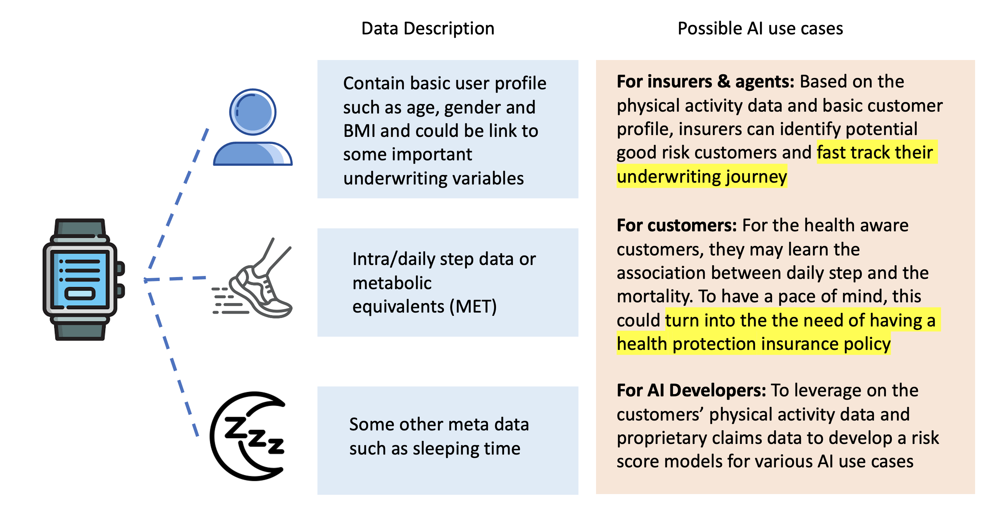
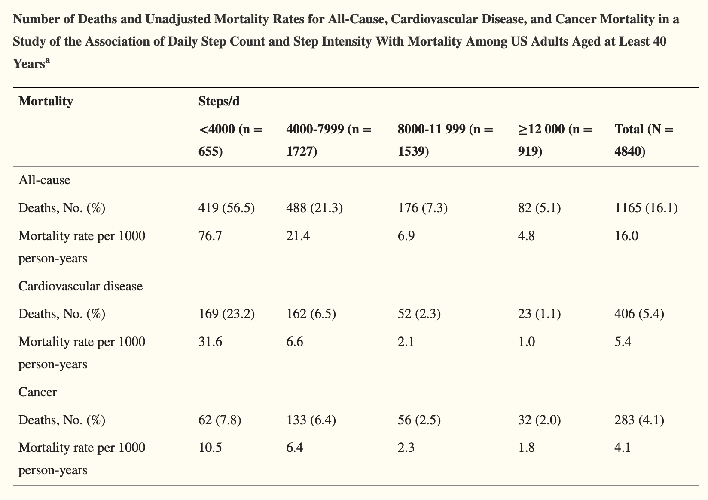
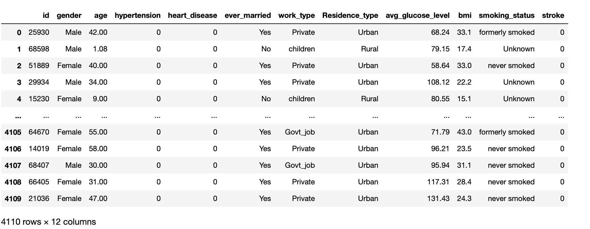
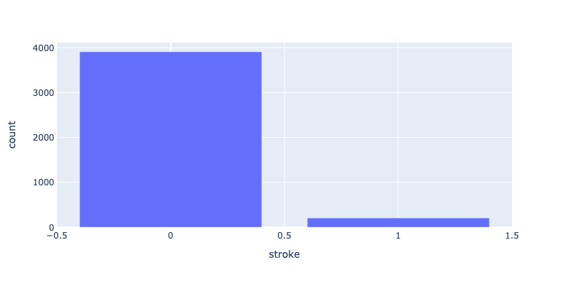
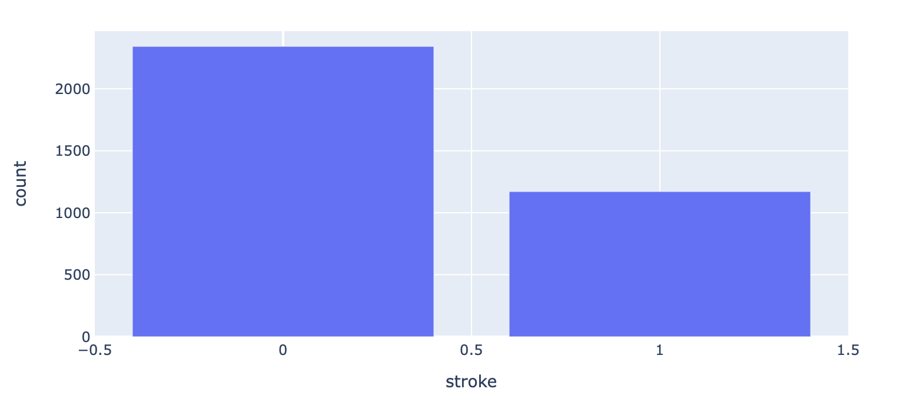
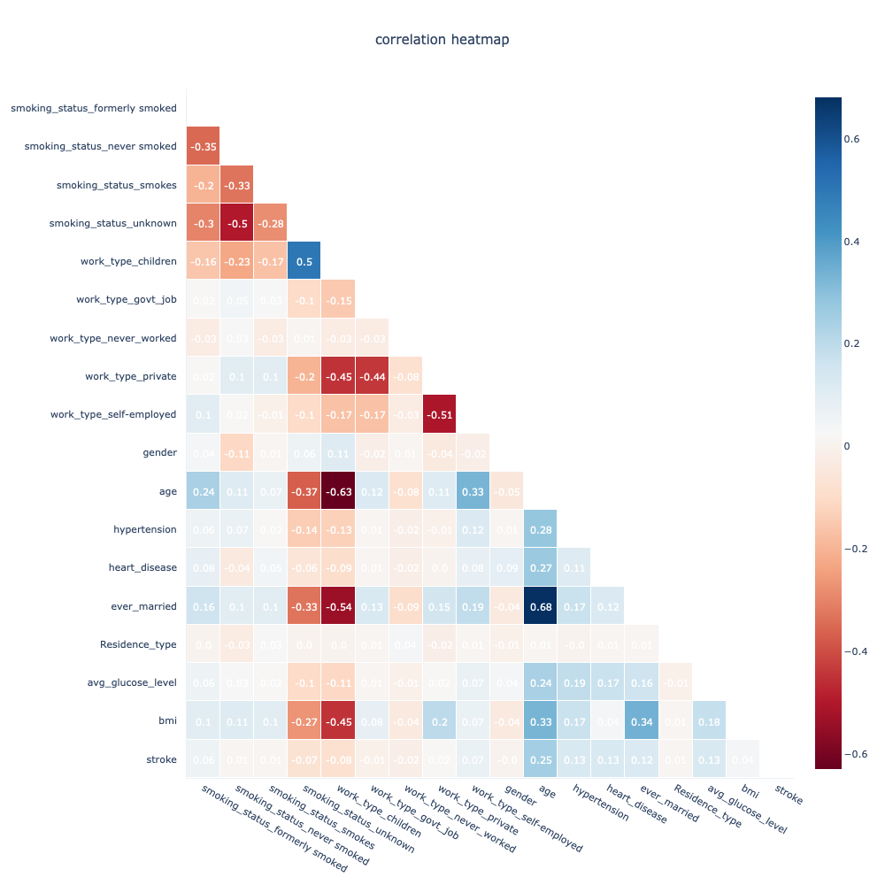
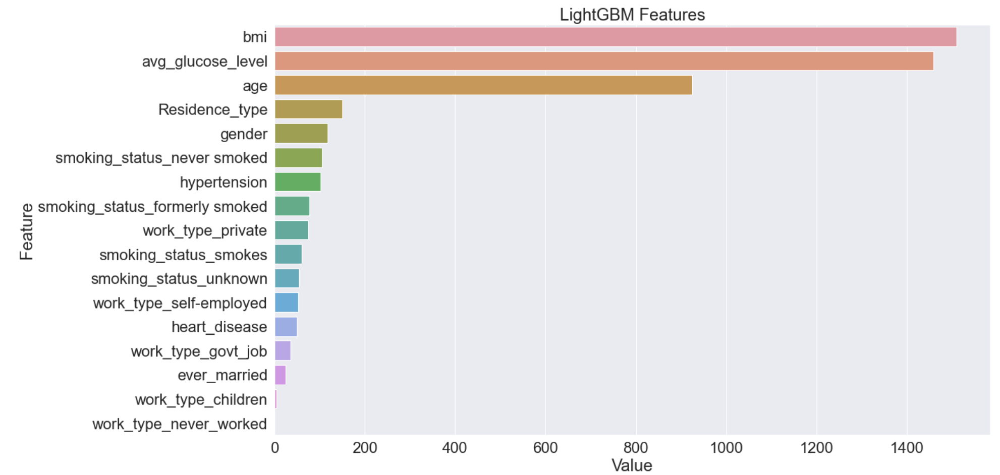
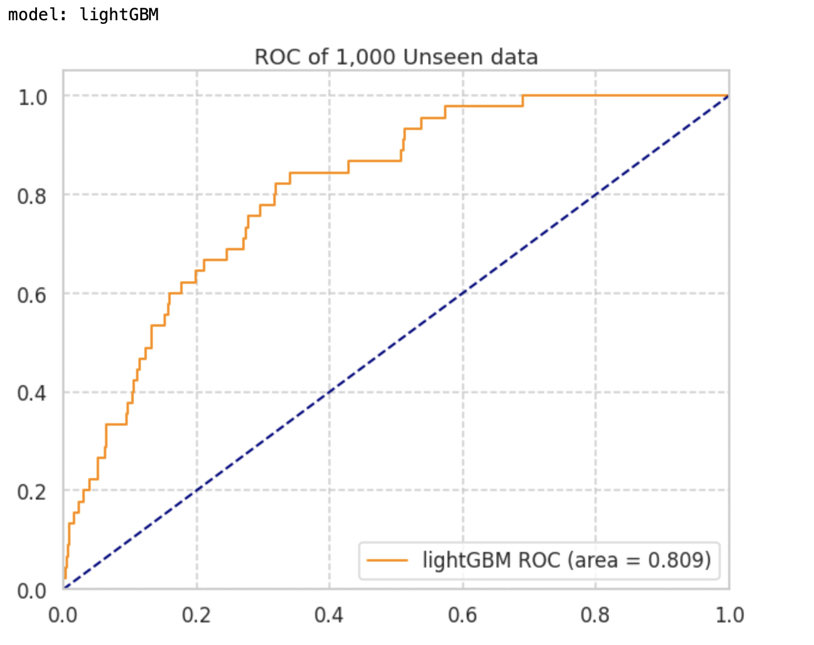
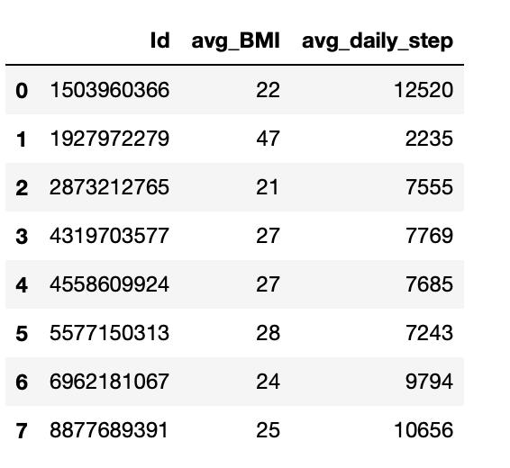

# Insurance Proposition with Physical Activity Data 

<p align="center"></p>


## Executive Summary

<p>
Insurance is sold, not bought. This statement is particlar true in life insurance business in Asia.
According to Swiss Re Institute estimated in 2021, none of the asian countries has life insurance penetration more than one-fifth of its population and the two biggest markets China and Indina is covering as low as 2.4% and 3.2% respectively. 
Desipte insurers rely heavily on their well trained agency taskforce to indentify new prospects, there are still many hurdles the agents need to go through to close the sales such as finding the right triggering point, explaining the product details and why the customers need it and assist the full medical underwriting process which may turn into a lenghty process to testify the real interest any new customers.
</p>

To address the pain points and smoothing the whole sales journey, we propose to develop a proprietary risk score model to support AI use cases for predictive underwriting as well as actionable the wellness information to the customers.




## Background & Introduction
<p>

In today's technology-driven world, smart wearables have experienced a huge surge in popularity. 
According to statista, the leading age group for wearable device in a typical Asian country such as South Koera is 30-39. 
In addition, for those who own the smart watches also associate to the quest of a healthy lifestyle as nearly all devices come with fitness tracking function with data sync to the mobile device or cloud for displaying useful information such as average daily steps.

</p>

<p>
To go along this group of milleninals, many companies had launched marketing campagins such as <a href="https://www.hsbc.com.hk/content/dam/hsbc/hk/docs/insurance/well-plus/user-guide.pdf" > Well+ </a> program from HSBC Life, <a href="https://www.manulife.com.hk/en/individual/products/manulifemove/about-manulifemove/move-program-and-app.html"> MOVE </a> program from Manulife and last but not least the <a href="https://www.aia.com/en/health-wellness/vitality"> vitality </a> program from AIA.
</p>

## Our proposal of risk score model

<p>

To go beyond marketing campaigns, we propose to develop a risk score models based on the data being captured in the smart wearables to support 2 AI use cases:
* a fast-track underwriting joruney for customers who receive a good risk score rating
* a wellness insight to customers and help them to understand the association of general health and the physical activity data. The insight could be a projected mortality risk in the coming 20 years and explain to them how health protection policy can give them a peace of mind.

</p>

<p>

In order to build the risk score models, we will need the labelled dataset which is currently absent in the dataset. It is therefore, we have sourced to a public dataset from the <a href="https://www.kaggle.com/datasets/fedesoriano/heart-failure-prediction "><a href="https://www.kaggle.com/datasets/fedesoriano/heart-failure-prediction ">Kaggle heart failure prediction</a> </a>  as the illustration of the model development process and act as an intrim solutions.
Moreover, as there is no public dataset on step data and the association to impairments, we will rely on the latest <a href="https://www.ncbi.nlm.nih.gov/pmc/articles/PMC7093766/">studies</a> from Saint-Maurice et al. (2020) on daily step and their implication to mortality due to cardiovascular disease.


The above table is extracted from the studies from Saint-Maurice et al. (2020)

</p>

<p>

Lastly, we will use the model we developed so far and inference the risk score on some of the tracking dataset we have at the end of the session.

</p>

## Highlight of model development process

#### With the kaggle dataset, this could be turned into a supervised machine learning problem

X: a set of independent variables containing age, gender and BMI
Y: whether there is a stroke observed or not

```python
train_df = pd.read_csv("Heart-Stroke-Prediction/train.csv")
train_df
```


#### However, it is observed the unbalanced class label with only 5% of them are with stroke



#### combining the oversampling and undersampling, we are able to uplift the class label distribution to 1:2
```python
X = train_encoded_df.drop(columns=["id", "stroke"])
y = train_encoded_df["stroke"]

# to oversampling the minority class to a ratio of 1:3
over = RandomOverSampler(sampling_strategy=0.3)
# to undersampling the majority class to a ratio of 2:1
under = RandomUnderSampler(sampling_strategy=0.5)
x_over, y_over = over.fit_resample(X, y)
x_comb, y_comb = under.fit_resample(x_over, y_over)
```




#### Correlation heatmap around the variables

It is noted that age, bmi, hypertension history, heart_disease history, married status, average glucose level and declaration of foremely smokers are positively correlated to the stroke - target variables



#### Five fold cross-valiation with hyperparameter search in lightGBM model

* <a href="https://optuna.org"> Optuna </a> is being used for the hyperparameter search 
* lightGBM is being used with search space for hyperparameters such as number of leaves, L1 & L2 regularization and learning rate


```python
class LightGBM(BaseModel):

    def __init__(self, params, args):
        super().__init__(params, args)

    def fit(self, X, y, X_val=None, y_val=None):
        train = lgb.Dataset(X, label=y, categorical_feature=self.args.cat_idx)
        val = lgb.Dataset(X_val, label=y_val, categorical_feature=self.args.cat_idx)
        self.model = lgb.train(self.params, train, num_boost_round=self.args.epochs, valid_sets=[val],
                               valid_names=["eval"], callbacks=[lgb.early_stopping(self.args.early_stopping_rounds),
                                                                lgb.log_evaluation(self.args.logging_period)],
                               categorical_feature=self.args.cat_idx)

        return [], []

    def predict_proba(self, X):
        probabilities = self.model.predict(X)

        if self.args.objective == "binary":
            probabilities = probabilities.reshape(-1, 1)
            probabilities = np.concatenate((1 - probabilities, probabilities), 1)

        self.prediction_probabilities = probabilities
        return self.prediction_probabilities

    @classmethod
    def define_trial_parameters(cls, trial, args):
        params = {
            "num_leaves": trial.suggest_int("num_leaves", 2, 128, log=True),
            "lambda_l1": trial.suggest_float("lambda_l1", 1e-8, 10.0, log=True),
            "lambda_l2": trial.suggest_float("lambda_l2", 1e-8, 10.0, log=True),
            "learning_rate": trial.suggest_float("learning_rate", 0.01, 0.3, log=True)
        }
        return params


```

#### Variables importance 


* The top three most important variables are BMI, average glucose level and age

#### Model validation with unseen dataset




#### The model inferencing on the given tracking dataset

Deriving and joing tables for the average BMI and daily step for the 8 users




```python
def map_cardiovascular_mortality_rate(x):
    if x < 4000:
        return 31.6/1000
    elif 4000 <= x < 7999:
        return 6.6/1000
    elif 8000 <= x < 11999:
        return 2.1/1000
    elif x>=12000:
        return 1/1000
    

avg_user_report_df["mortality_rate_cardic"] = avg_user_report_df.avg_daily_step.apply(map_cardiovascular_mortality_rate)
avg_user_report_df["extra_cardic_mortality__rate"] = avg_user_report_df["prob_stroke"]*avg_user_report_df["mortality_rate_cardic"]*100
avg_user_report_df.sort_values(by="extra_cardic_mortality__rate", ascending=True)
```

Given the risk score model (lightGBM) just built and the studies from Saint-Maurice et al. (2020), we are able to inference the probality of getting the stroke and based on the daily step data we can apply the expected mortality rate.
Finally, we can multiply the P(Stroke) and P(mortality | step data, cardiovascular disease) to produce a socre of extra-mortality

## Future Direction and current limitation

In this study, we used the kaggle dataset to develop a stroke indication risk score model and use it as a proxy of health risk score. Also with the absence of the step data and the association to the incident rate, we have to rely on the extra studies to inference the health risk regarding the step data.
In the future, we recommend to leverage on the claims data to rebuild the model and learn the direct correlationship between the physical activity data and health risk
Moreover, given there is no demographic distribution in the sample tracking data, we have made some assumption on the distribution for the inferencing such as male with age 50.

# insurance_proposition_with_physical_-activity_data
# insurance_proposition_with_physical_-activity_data
# insurance_proposition_with_physical_-activity_data
# insurance_proposition_with_physical_-activity_data
# insurance_proposition_with_physical_-activity_data
# insurance_proposition_with_physical_-activity_data
# insurance_proposition_with_physical_-activity_data
# insurance_proposition_with_physical_activity_data
# insurance_proposition_with_physical_activity_data
# insurance_proposition_with_physical_activity_data
# insurance_proposition_with_physical_-activity_data
# insurance_proposition_with_physical_-activity_data
# insurance_proposition_with_physical_activity_data
# insurance_proposition_with_physical_activity_data
# insurance_proposition_with_physical_activity_data
