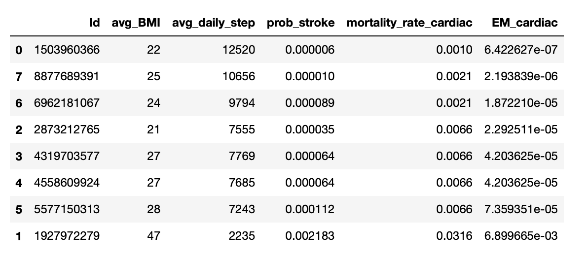

# Insurance Proposition with Physical Activity Data 

<p align="center"></p>


## Executive Summary

<p>
Insurance is sold, not bought. This statement is particularly true in the life insurance business in Asia.
According to the Swiss Re Institute estimated in 2021, none of the Asian countries has life insurance penetration of more than one-fifth of its population and the two biggest markets China and India are covering as low as 2.4% and 3.2% respectively. 
Despite insurers relying heavily on their well trained agency task force to identify new prospects, there are still many hurdles the agents need to go through to close the sales such as finding the right triggering point, explaining the product details and why the customers need it and assist the full medical underwriting process which may turn into a lengthy process to testify the real interest of any new customers.
</p>

To address the pain points, we propose a proprietary risk score model based on physical activity data extracted from smart wearables to smooth the sales journey as well as provide actionable wellness info back to the customers.


## Background & Introduction
<p>

In today's technology-driven world, smart wearables have experienced a huge surge in popularity. 
According to Statista, the leading age group for wearable devices in a typical Asian country such as South Korea is 30-39. 
In addition, for those who own the smart watches are also associate with the quest for a healthy lifestyle as nearly all devices come with a fitness tracking function with data syncing to the mobile device or cloud for displaying useful information such as average daily steps.

</p>

<p>
To go along with this group of millennials, many companies had launched marketing campaigns such as <a href="https://www.hsbc.com.hk/content/dam/hsbc/hk/docs/insurance/well-plus/user-guide.pdf" > Well+ </a> program from HSBC Life, <a href="https://www.manulife.com.hk/en/individual/products/manulifemove/about-manulifemove/move-program-and-app.html"> MOVE </a> program from Manulife and last but not least the <a href="https://www.aia.com/en/health-wellness/vitality"> vitality </a> program from AIA.
</p>

## Our proposal of risk score model

<p>

To go beyond marketing campaigns, we propose to develop a risk score model based on the data being captured in the smart wearables to support 2 AI use cases:
* a fast-track underwriting journey for customers who receive a good risk score rating
* a wellness insight to customers and help them to understand the association between general health and physical activity data. The insight could be a projected mortality risk in the coming 20 years and explain to them how health protection policy can give them peace of mind.

</p>

<p>

In order to build the risk score models, we will need the labelled dataset which is currently absent in the dataset. It is therefore, we have sourced a public dataset from the <a href="https://www.kaggle.com/datasets/fedesoriano/heart-failure-prediction "><a href="https://www.kaggle.com/datasets/fedesoriano/heart-failure-prediction ">Kaggle heart failure prediction</a> </a>  as an illustration of the model development process and act as an interim solution.
Moreover, as there is no public dataset on step data and the association to impairments, we will rely on the latest <a href="https://www.ncbi.nlm.nih.gov/pmc/articles/PMC7093766/">studies</a> from Saint-Maurice et al. (2020) on the daily step and their implication for mortality due to cardiovascular disease.


The above table is being extracted from the studies by Saint-Maurice et al. (2020)

</p>

<p>

Lastly, we will use the model we developed so far and inference the risk score on some of the tracking dataset we have at the end of the session.

</p>

## Highlight of model development process

#### With the kaggle dataset, this could be turned into a supervised machine learning problem

X: a set of independent variables such as age, gender and BMI </br>
Y: whether there is a stroke observed 

```python
train_df = pd.read_csv("Heart-Stroke-Prediction/train.csv")
train_df
```


#### However, it is observed the unbalanced label class with only 5% belong to cases with stroke


#### Combining the oversampling and undersampling, we are able to uplift the class label balance to a ratio of 1:2
```python
X = train_encoded_df.drop(columns=["id", "stroke"])
y = train_encoded_df["stroke"]

# to oversampling the minority class to a ratio of 1:3
over = RandomOverSampler(sampling_strategy=0.3)
# to undersampling the majority class to a ratio of 2:1
under = RandomUnderSampler(sampling_strategy=0.5)
x_over, y_over = over.fit_resample(X, y)
x_comb, y_comb = under.fit_resample(x_over, y_over)
```


#### Correlation heatmap for the variables

It is noted that age, bmi, hypertension history, heart_disease history, married status, average glucose level and declaration of formerly smokers are positively correlated to the stroke - target variables


#### 5-fold cross-valiation with hyperparameter search in lightGBM model

* <a href="https://optuna.org"> Optuna </a> is being used for the hyperparameters' search 
* lightGBM is being used with hyperparameters such as number of leaves, L1 & L2 regularization and learning rate


```python
class LightGBM(BaseModel):

    def __init__(self, params, args):
        super().__init__(params, args)

    def fit(self, X, y, X_val=None, y_val=None):
        train = lgb.Dataset(X, label=y, categorical_feature=self.args.cat_idx)
        val = lgb.Dataset(X_val, label=y_val, categorical_feature=self.args.cat_idx)
        self.model = lgb.train(self.params, train, num_boost_round=self.args.epochs, valid_sets=[val],
                               valid_names=["eval"], callbacks=[lgb.early_stopping(self.args.early_stopping_rounds),
                                                                lgb.log_evaluation(self.args.logging_period)],
                               categorical_feature=self.args.cat_idx)

        return [], []

    def predict_proba(self, X):
        probabilities = self.model.predict(X)

        if self.args.objective == "binary":
            probabilities = probabilities.reshape(-1, 1)
            probabilities = np.concatenate((1 - probabilities, probabilities), 1)

        self.prediction_probabilities = probabilities
        return self.prediction_probabilities

    @classmethod
    def define_trial_parameters(cls, trial, args):
        params = {
            "num_leaves": trial.suggest_int("num_leaves", 2, 128, log=True),
            "lambda_l1": trial.suggest_float("lambda_l1", 1e-8, 10.0, log=True),
            "lambda_l2": trial.suggest_float("lambda_l2", 1e-8, 10.0, log=True),
            "learning_rate": trial.suggest_float("learning_rate", 0.01, 0.3, log=True)
        }
        return params


```

#### Variables importance 


* The top three most important variables are BMI, average glucose level and age

#### Model validation with unseen dataset


#### The model inferencing on the given tracking dataset

Joining the tracking dataset for the average BMI and daily step for the 8 users
We first used the risk score model developed to infer the stroke risk score with the assumption that all of them are males and aged 50
Then we applied the mortality rate on the daily step data as per below

```python
def map_cardiovascular_mortality_rate(x):
    if x < 4000:
        return 31.6/1000
    elif 4000 <= x < 7999:
        return 6.6/1000
    elif 8000 <= x < 11999:
        return 2.1/1000
    elif x>=12000:
        return 1/1000

avg_user_report_df["mortality_rate_cardiac"] = avg_user_report_df.avg_daily_step.apply(map_cardiovascular_mortality_rate)
avg_user_report_df["EM_cardiac"] = avg_user_report_df["prob_stroke"]*avg_user_report_df["mortality_rate_cardiac"]*100
avg_user_report_df.sort_values(by="EM_cardiac", ascending=True)
```



Given the risk score model (lightGBM) and the studies by Saint-Maurice et al. (2020), we are able to infer the probability of getting a stroke and based on the daily step data we can apply the expected mortality rate.
Finally, we can multiply the P(Stroke| profile) and P(mortality | step data, cardiovascular) to produce a score of extra-mortality and this could be served for the customer wellness info as well as for UW fast track.

## Future Direction and current limitation

* In this study, we used the kaggle dataset to develop a stroke indication risk score model and used it as a proxy for health risk score. Also, with the absence of the step data and the association between the incident rate and step data, we have to rely on the external studies to infer the health risk for the step data.
* In the long term, we recommend relying on the claim & wearable dataset collected to rebuild the model and learn the direct correlations between the physical activity data and their associated health risk.
* Moreover, given there is no demographic distribution in the sample tracking data, we have made some assumptions on the distribution such as male customers with age 50 years old who are lived in US.

